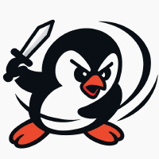

# Online Division Org.

The Organization maintaining the official Online Division Desktop Client and all the Official Ecosystem Components of the project, together with the F.O.S.S. tools that help you build an Online Division Ecosystem of your own.

    

